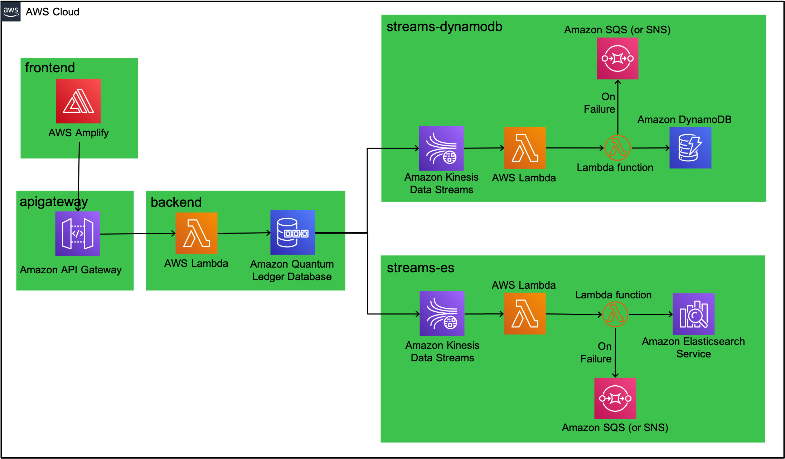

# QLDB Bicycle Licence

The QLDB Bicycle Licence application is a sample application to demonstrate some of the capabilities of `Amazon QLDB` and how it can be used to build out a serverless event-driven application.

The basic architecture overview of the application is shown below:



Each seperate deployment is setup in a different folder in this repository. This allows the application to be deployed one component at a time.

## Deployments

Once the repository is cloned, it is important to deploy components in a specific order. By default, all deployments will use a stage name of `dev`, but this can be overridden using the `--stage` attribute.

### API Gateway

The first component to be deployed is the centralised API Gateway. This is used to provide a single endpoint

``` bash
cd apigateway
npm ci
npm run sls -- deploy --stage {stage-name}
```

For more information about the API Gateway setup, see the individual [readme](/apigateway) file.

### Backend

Next to be deployed are the backend components, consisting of AWS Lambda functions and Amazon QLDB

``` bash
cd backend
npm ci
sls deploy [--stage {stage-name}]
```

The API endpoints will be output when the components are deployed. You will need to make a note of the base URL endpoint for the next section.

```bash
endpoints:
  POST - https://{example}.execute-api.eu-west-1.amazonaws.com/dev/licences
  PUT - https://{example}.execute-api.eu-west-1.amazonaws.com/dev/licences
  PUT - https://{example}.execute-api.eu-west-1.amazonaws.com/dev/licences/contact
  GET - https://{example}.execute-api.eu-west-1.amazonaws.com/dev/licences/{licenceid}
  GET - https://{example}.execute-api.eu-west-1.amazonaws.com/dev/licences/history/{licenceid}
  DELETE - https://{example}.execute-api.eu-west-1.amazonaws.com/dev/licences
```

For more information about the backend setup, see the individual [readme](/backend) file.

### Frontend

At this point, the UI can be deployed and configured. The first step is to update the frontend Amplify configuration in ```./frontend/src/index.js``` with the base URL endpoint.

``` javascript
Amplify.configure({
  API: {
    endpoints: [
      {
        endpoint:
          "https://{example}.execute-api.eu-west-1.amazonaws.com/dev",
        name: "ApiGatewayRestApi",
        region: "eu-west-1",
      },
    ],
  },
});
```

The frontend can then be run locally using the following commands:

``` bash
cd frontend
npm ci
npm run start
```

## Load testing

A `Serverless Artillery` setup has been configured to allow an initial data load to be carried out.

```bash
cd loadtesting
npm run slsart -- deploy --stage dev
npm run slsart -- invoke --stage dev
```

For more information about the load testing setup, see the individual [readme](/loadtest) file.
