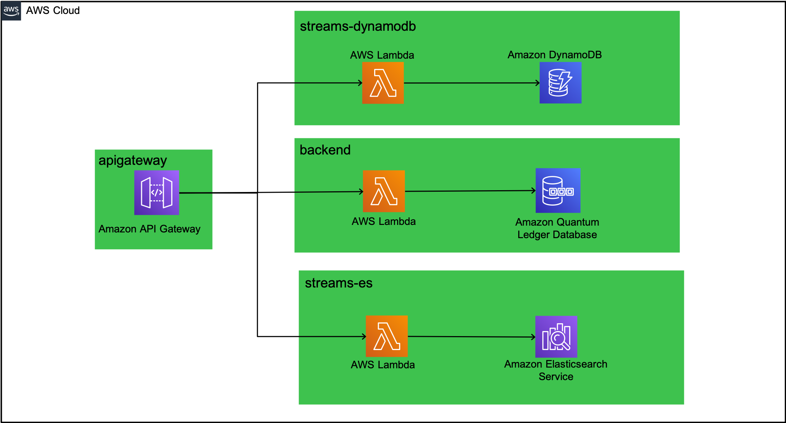

# QLDB Bicycle Licence - API Gateway

The API Gateway component provides a centralised endpoint for all API requests, whether these are fulfilled by QLDB, DynamoDB or Elasticsearch.



This is carried out to allow different consumers to target a single endpoint for simplicity. 

In the `serverless.yml` file, a REST API is created and its value exported along with its root resource ID:

```yaml
  Outputs:
    apiGatewayRestApiId:
      Value:
        Ref: QldbApiGW
      Export:
        Name: QldbApiGateway-restApiId

    apiGatewayRestApiRootResourceId:
      Value:
        Fn::GetAtt:
          - QldbApiGW
          - RootResourceId
      Export:
        Name: QldbApiGateway-rootResourceId
```

Other stacks can then import these values as shown below:

```yaml
provider:
  name: aws
  apiGateway:
    restApiId: !ImportValue QldbApiGateway-restApiId
    restApiRootResourceId: !ImportValue QldbApiGateway-rootResourceId
  ...
```
