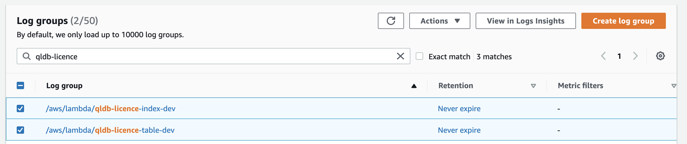

# QLDB Bicycle Licence - Backend

## Overview

The backend components of the Bicycle Licence sample application setup the Amazon QLDB Ledger, and provides a number of APIs to interact with the ledger.

## Creating the Ledger

The stack can be deployed by using the following commands:

``` bash
cd backend
npm ci
sls deploy [--stage {stage-name}]
```

By default, a stage name of `dev` is configured, but this can be overridden at deployment time.

## Removing the Ledger

The stack can be removed at any point in time using the following command:

``` bash
sls remove [--stage {stage-name}]
```

The stack using an `AWS Lambda` custom resource to create the table and indexes in QLDB. Unfortunately, the `CloudWatch Log Group` for these custom resources is not automatically removed. If you then try and deploy the stack again, you will get the following error:

```bash
Serverless Error ----------------

An error occurred: CreateQLDBTableLogGroup - Resource of type `AWS::Logs::LogGroup` with identified '{"/properties/LogGroupName":"/aws/lambda/qldb-licence-table-dev"}' already exists..
```

This can be resolved by going into CloudWatch in the AWS Console and deleting the following Log Groups:

