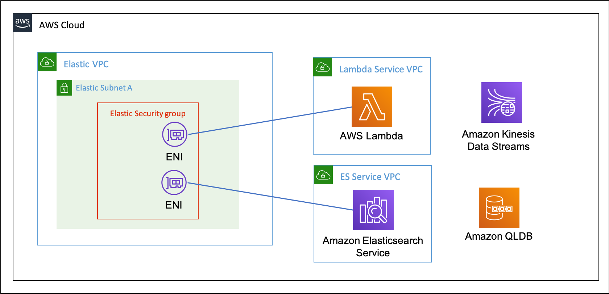

# QLDB Bicycle Licence - Streams Elasticsearch

## Overview

The AWS services being used for this are shown in the diagram below. Note that both `Elasticsearch` and `Lambda` are configured to connect to the VPC by establishing an Elastic Network Interface (ENI):



## Deploying Streams ES

This can be deployed as follows:

``` bash
cd streams-es
npm ci
npm run sls -- deploy [--stage {stage-name}]
```

In some cases, the initial deployment may fail with the following error message:

```bash
'ValidationException: Before you can proceed, you must enable a service-linked role to give Amazon ES permissions to access your VPC'
```

In this case, create a service-linked role first using the `AWS CLI` with the following command:

```bash
aws iam create-service-linked-role --aws-service-name es.amazonaws.com
```

## Configuring Elasticsearch

Elasticsearch is a leading open source search and analytics solution. The deployment follows AWS recommended best practice using VPC access. This uses private IP addresses from your VPC, and you control access using security groups. This means that connectivity between ES and other services within the VPC don't require an internet gateway, NAT device or VPN connection. All traffic remains securely within the AWS Cloud. This is the rationale for connecting the Lambda function to the VPC as well.

The `serverless.yml` file creates a new VPC, a single subnet, and a security group that has a nework ingress rule for port 443 to allow connectivity to the Elasticsearch domain.

```yaml
    ElasticVPC:
      Type: AWS::EC2::VPC
      Properties:
        CidrBlock: "10.0.0.0/16"
        EnableDnsSupport: true
        EnableDnsHostnames: true
        Tags:
          - Key: Name
            Value: qldb-streams-elastic

    ElasticSubnetA:
      DependsOn: ElasticVPC
      Type: AWS::EC2::Subnet
      Properties:
        VpcId:
          Ref: ElasticVPC
        AvailabilityZone: ${self:provider.region}a
        CidrBlock: "10.0.2.0/24"
        Tags:
          - Key: Name
            Value: qldb-streams-es-a
        
    ElasticSecurityGroup:
      DependsOn: ElasticVPC
      Type: AWS::EC2::SecurityGroup
      Properties:
        GroupDescription: SecurityGroup for Elasticsearch
        VpcId:
          Ref: ElasticVPC
        SecurityGroupIngress: 
          - FromPort: '443' 
            IpProtocol: tcp 
            ToPort: '443' 
            CidrIp: 0.0.0.0/0
        Tags:
          - Key: Name
            Value: qldb-streams-es-sg

```

The AWS VPC is setup with `enableDnsSupport` option set to true to ensure the Amazon ES endpoint will succeed. There is only a single subnet created. The security group is used by both the Lambda function and Amazon ES, and opens up port 443 to allow connection to the Amazon ES domain.

The following configuration is used to setup the ES domain:

```yaml
    ElasticSearch:
      Type: AWS::Elasticsearch::Domain
      Properties:
        DomainName: "#{AWS::StackName}"
        ElasticsearchVersion: 7.7
        ElasticsearchClusterConfig:
          DedicatedMasterEnabled: false
          InstanceCount: "1"
          InstanceType: r5.large.elasticsearch
          ZoneAwarenessEnabled: false
        EBSOptions:
          EBSEnabled: true
          Iops: 0
          VolumeSize: 10
          VolumeType: standard
        EncryptionAtRestOptions:
          Enabled: true
          KmsKeyId: arn:aws:kms:${self:provider.region}:#{AWS::AccountId}:alias/aws/es
        NodeToNodeEncryptionOptions:
          Enabled: true
        DomainEndpointOptions:
          EnforceHTTPS: true
        AccessPolicies:
          Version: "2012-10-17"
          Statement:
            - Effect: Allow
              Principal:
                AWS: "*"
              Action: es:ESHttp*
              Resource: arn:aws:es:${self:provider.region}:#{AWS::AccountId}:domain/#{AWS::StackName}/*
        VPCOptions: 
          SubnetIds: 
            - !Ref ElasticSubnetA 
          SecurityGroupIds: 
            - !Ref ElasticSecurityGroup
```

In the `ElasticsearchClusterConfig` section a single instance is configured. This is the most basic setup for development and testing, which will run in just a single availability zone (hence only configuring a single subnet. For production workloads, AWS recommend three dedicated primary instances and at least three data nodes spread across three AZ's.

The instance is an `r5.large.elasticsearch` instance (current pricing of $0.141/hour on demand). This can be changed to a `t2.medium.elasticsearch` instance (current pricing of $0.05/hour on demand).

To demonstrate addition features to protect data, the ES domain is configured with:

* `EnforceHTTPS` enabled in `DomainEndpointOptions`. This ensures that the domain only accepts requests over HTTPS
* `NodeToNodeEncryptionOptions` enabled where all node-to-noe encryption within the ES domain uses TLS
* `EncryptionAtRestOptions` enabled using the KMS ES master key. This ensures that the indices and automated snapshots associated with the domain are encrypted.

## Signing Requests to Elasticsearch

In some cases, you may need to sign an HTTP request for Amazon ES to accept it. AWS Lambda has an IAM role to execute the function called the execution role. This role provides the Lambda function with the credentials it needs, and they are used to sign the request.

The sample code used is below:

```javascript
const creds = new AWS.EnvironmentCredentials('AWS');
const request = new AWS.HttpRequest(endpoint, REGION);
request.method = httpMethod;
request.headers['Content-Type'] = 'application/json';
...
const signer = new AWS.Signers.V4(request, 'es');
signer.addAuthorization(creds, new Date());
```

If the wrong role is used, then the request will be rejected by ES with a message returned like the one below:

```json
{
    "Message": "User: arn:aws:sts::{AccountId}:assumed-role/abc/xyz
    is not authorized to perform: es:ESHttpPut"
}
```

## Creating and Updating Documents

Elasticsearch is distributed. Whenever a document is created, updated or deleted, the new version is replicated to other nodes in the cluster. Elasticsearch is also aynchronous and concurrent, and so requests may arrive out of sequence. To ensure an older version of a document doesn't update a newer version, every operation is assigned an incrementing sequence number. By default, internal versioning is used that starts at 1.

There is also a challenge around sequencing with QLDB streams:

> QLDB streams provide an at-least-once delivery guarantee. Each data record that is produced by a QLDB stream is delivered to Kinesis Data Streams at least once. The same records can appear in a Kinesis data stream multiple times. So you must have deduplication logic in the consumer application layer if your use case requires it.

> There are also no ordering guarantees. In some circumstances, QLDB blocks and revisions can be produced in a Kinesis data stream out of order.

Luckily, there is a really elegant solution to solve these problems.

Elasticsearch supports the use of an external value as a version number by setting `version_type` to external. With this, the system checks that the version number passed in to the index request is greater than the version of the currently stored document, else the update will fail with a version conflict.

QLDB automatically generates a unique identifier for each document created, which includes a version number that is incremented on each subsequent revision. The unique identifier is the `id` field found in the `metadata` section. Every `REVISION_DETAILS` message in the QLDB stream will have the `id` and `version` of the document in the `metadata` section. The `id` must be used as the identifier as an empty data section is sent if a document is deleted.

The code to both create and update a document in Elasticsearch is identical, and shown below:

```javascript
const doc = {
    "licenceId": licenceId,
    "points": points,
    "postcode": postcode,
    "version": version,
    "name": name
};
response = await sendRequest({ 
    httpMethod: 'PUT', 
    requestPath: `/licence/_doc/${id}?version=${version}&version_type=external`, 
    payload: doc 
});
```

The code uses the `Index API` to add a JSON document to the specified index (in this case 'licence'), and make it searchable. If the document doesn't exist it is created. If it does exist and the version number passed in is greater, then the document is updated. For creates and updates, QLDB sends through the whole document in the REVISION_DETAILS section, so it is a case of overwriting all the data.

When a document is successfully created or updated, you will get back a response message such as:

```json
{
  "_index": "licence",
  "_type": "_doc",
  "_id": "7YQHLWaY7RE23T7NBSG2B6",
  "_version": 4,
  "_score": 0,
  "_source": {
    "licenceId": "7YQHLWAY7RE23T7NBSG2B6",
    "points": 11,
    "postcode": "AB123DE",
    "version": 4,
    "name": "Matt Lewis"
  }
}
```

Testing showed that records would be received out of order when processing the Kinesis data stream. Using the external version_type prevented overwriting newer versions with older versions as can be seen by the following version conflict error message that is returned.

```json
{
  "error": {
    "root_cause": [
      {
        "type": "version_conflict_engine_exception",
        "reason": "[7YQHLWaY7RE23T7NBSG2B6]: version conflict, 
            current version [4] is higher or equal to the one 
            provided [2]",
        "index_uuid": "4dhIyzS1TY6HCyTNNKKLQg",
        "shard": "1",
        "index": "licence"
      }
    ],
    "type": "version_conflict_engine_exception",
    "reason": "[7YQHLWaY7RE23T7NBSG2B6]: version conflict, 
        current version [4] is higher or equal to the one 
        provided [2]",
    "index_uuid": "4dhIyzS1TY6HCyTNNKKLQg",
    "shard": "1",
    "index": "licence"
  },
  "status": 409
}
```

Another advantage of using the id and version values from the QLDB metadata section is that you can use the values returned in the reason field to look up either the latest current version on QLDB:

```bash
SELECT * FROM _ql_committed_BicycleLicence AS b
WHERE b.metadata.id = '7YQHLWaY7RE23T7NBSG2B6'
```

or else look up all revisions for the specific id:

```bash
SELECT * FROM history( BicycleLicence ) AS h
WHERE h.metadata.id = '7YQHLWaY7RE23T7NBSG2B6'
```